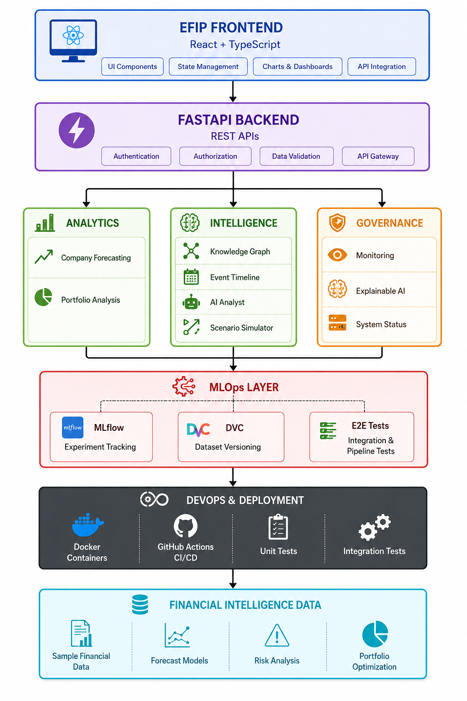
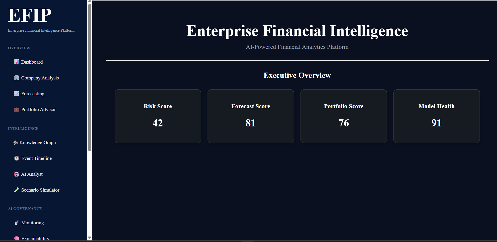
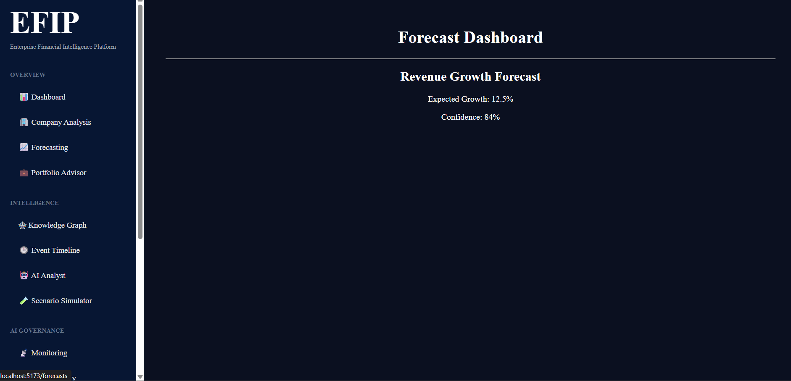
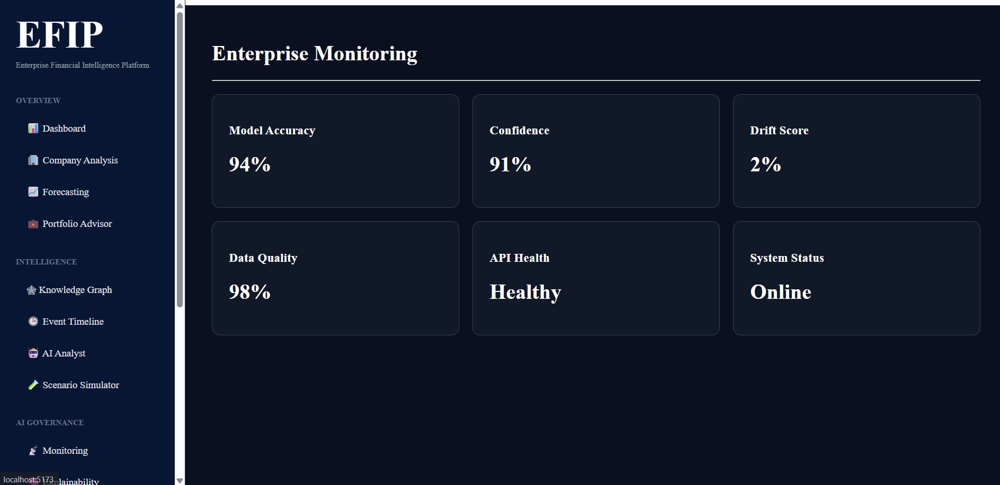
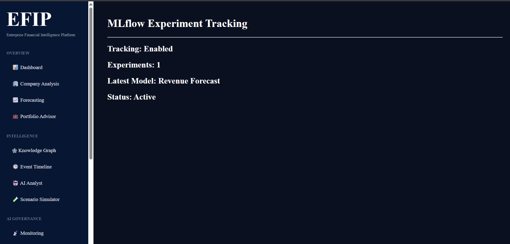
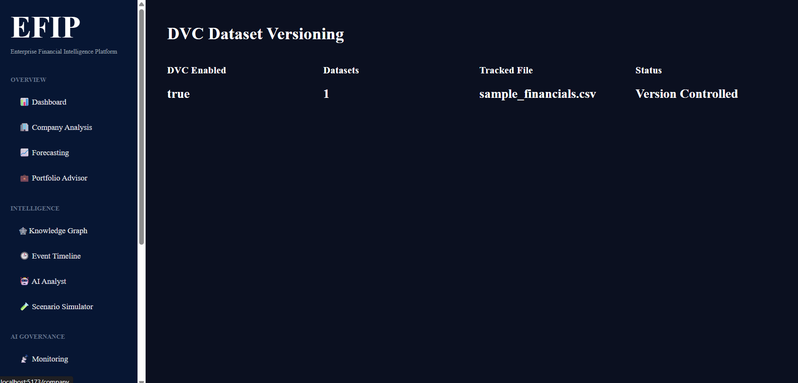

# 🚀 Enterprise Financial Intelligence Platform (EFIP)

### AI-Powered Financial Analytics, Forecasting & MLOps Platform


---

## 📖 Overview

Enterprise Financial Intelligence Platform (EFIP) is a full-stack financial analytics platform that combines forecasting, portfolio intelligence, explainable AI, monitoring, testing, and MLOps into a unified enterprise dashboard.

Built using modern software engineering practices, EFIP demonstrates end-to-end development across:

- Full-Stack Development
- Financial Analytics
- Machine Learning Operations (MLOps)
- DevOps & CI/CD
- Enterprise Monitoring
- Automated Testing

---

## 🏗️ Architecture



### High-Level Flow

```text
React + TypeScript Frontend
            │
            ▼
      FastAPI Backend
            │
 ┌──────────┼──────────┐
 ▼          ▼          ▼
Analytics Intelligence Governance
            │
            ▼
        MLOps Layer
            │
            ▼
      Docker + CI/CD
            │
            ▼
      Financial Data
```

---

# ✨ Features

## 📊 Analytics

- Company Analysis
- Revenue Forecasting
- Portfolio Advisor
- Financial KPI Monitoring

## 🧠 Intelligence

- Knowledge Graph
- Event Timeline
- AI Analyst
- Financial Scenario Simulator

## 🛡️ Governance

- Monitoring Dashboard
- Explainable AI (XAI)
- System Status Dashboard

## ⚙️ MLOps

- MLflow Experiment Tracking
- DVC Dataset Versioning
- End-to-End Pipeline Testing

---

# 🛠️ Technology Stack

## Frontend

- React
- TypeScript
- Axios
- React Router

## Backend

- FastAPI
- Python

## MLOps

- MLflow
- DVC

## DevOps

- Docker
- GitHub Actions

## Testing

- Pytest
- Unit Testing
- Integration Testing
- End-to-End Testing

---

# 📦 Modules

| Module | Description |
|----------|-------------|
| Dashboard | Executive overview and KPIs |
| Company Analysis | Financial intelligence and analysis |
| Forecasting | Revenue and trend forecasting |
| Portfolio Advisor | Portfolio optimization |
| Knowledge Graph | Entity relationship visualization |
| Event Timeline | Financial event tracking |
| AI Analyst | AI-powered financial insights |
| Scenario Simulator | Financial what-if analysis |
| Monitoring | Application monitoring |
| Explainable AI | Model transparency and explainability |
| System Status | Production readiness dashboard |
| MLflow | Experiment tracking |
| DVC | Dataset version control |
| E2E Testing | Pipeline validation |

---

# 🌐 API Documentation

Interactive Swagger Documentation:

```text
http://localhost:8000/docs
```

### Available Endpoints

```text
GET  /dashboard
GET  /company
GET  /forecast
POST /scenario
GET  /monitoring
GET  /system-status
GET  /mlflow-status
GET  /dvc-status
GET  /e2e-status
```

---

# 🚀 Installation

## Clone Repository

```bash
git clone <your-repository-url>

cd Enterprise-Financial-Intelligence-Platform
```

## Backend Setup

```bash
cd backend

python -m venv .venv

pip install -r requirements.txt

uvicorn app.main:app --reload
```

Backend:

```text
http://localhost:8000
```

---

## Frontend Setup

```bash
cd frontend

npm install

npm run dev
```

Frontend:

```text
http://localhost:5173
```

---

# 🧪 Testing

### Run All Tests

```bash
python -m pytest tests
```

### Run End-to-End Pipeline Test

```bash
python -m pytest tests/test_e2e_pipeline.py
```

---

# 📸 Screenshots

## Dashboard



## Forecasting



## Monitoring



## MLflow Tracking



## DVC Dataset Versioning



---

# 📈 MLOps Capabilities

### MLflow

- Experiment Tracking
- Model Metadata Management
- Training Run Monitoring

### DVC

- Dataset Version Control
- Data Lineage Tracking
- Reproducible Pipelines

### Testing

- Unit Tests
- Integration Tests
- End-to-End Pipeline Validation

---

# 🎯 Project Highlights

✅ Full-Stack Architecture  
✅ Financial Analytics Platform  
✅ React + FastAPI Stack  
✅ MLflow Integration  
✅ DVC Dataset Versioning  
✅ Dockerized Deployment  
✅ GitHub Actions CI/CD  
✅ Monitoring & Governance  
✅ Explainable AI  
✅ End-to-End Testing  

---

# 🛣️ Future Roadmap

### Phase 21

- PostgreSQL Integration
- Redis Caching
- Authentication & RBAC

### Phase 22

- Real-Time Financial Data APIs
- SEC Filing Analysis
- Streaming Analytics

### Phase 23

- LLM Financial Analyst
- Retrieval-Augmented Generation (RAG)
- Multi-Agent Financial Intelligence

### Phase 24

- Kubernetes Deployment
- Prometheus Monitoring
- Grafana Dashboards

---

# 👨‍💻 Author

**Roshan**  
B.Tech Electronics & Communication Engineering  
SRM Institute of Science and Technology

---

## ⭐ If you found this project interesting, consider giving it a star.
